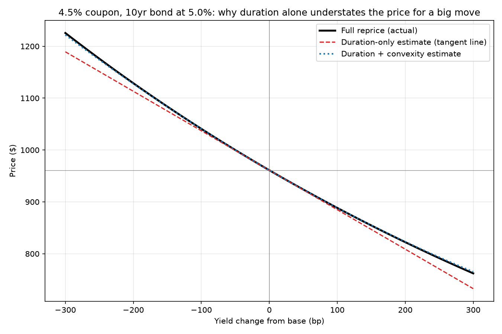
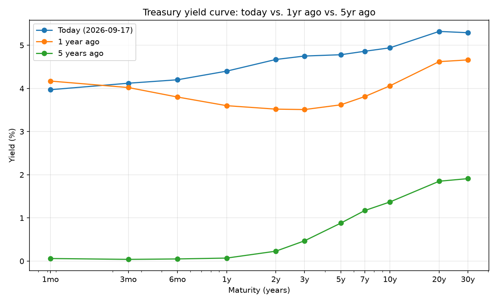
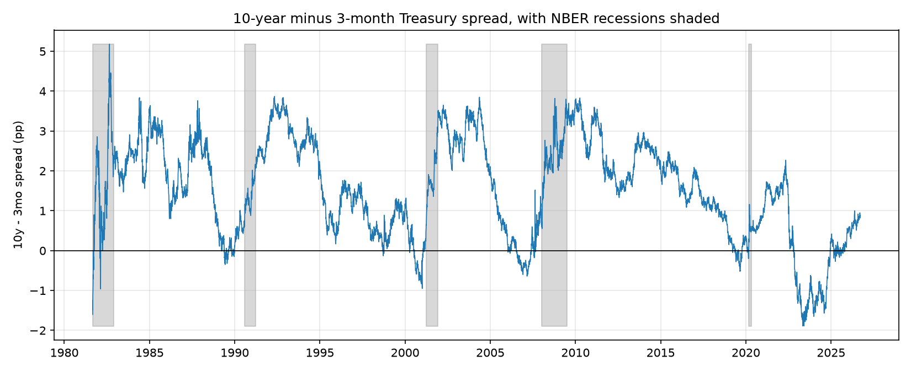

# bond-math

A fixed income calculator and Treasury yield curve tool for an individual
investor who wants to check a bond's price, yield, and interest-rate risk
by hand and understand exactly how each number was produced. It prices
bonds from a yield (and solves the reverse), computes duration and
convexity, builds a bond ladder, and charts the Treasury curve. It
deliberately does **not** do credit analysis, price the embedded option in
a callable bond, model municipal bond tax treatment, or use any bond trade
data beyond free Treasury constant-maturity series from FRED.

Companion projects: [econ-indicators](https://github.com/by-tayo/econ-indicators)
(a composite leading recession index, backtested against NBER dates).

## Questions this tool answers

- What is this bond worth at today's yields?
- What yield am I actually earning if I buy at this price?
- If rates rise 1%, how much do I lose?
- What does the Treasury curve look like now versus a year ago, and five
  years ago?
- How much does a fund's expense ratio cost me over 30 years?

## Worked example

A 10-year, 4.5% coupon bond (semiannual, $1,000 face), at a 5.00% market
yield (`python 01_price_bond.py`):

```
Price: $961.03
Yield to maturity (solved back from price): 5.0000%
Macaulay duration: 8.117 years
Modified duration: 7.919
Convexity: 75.300

If rates rise 1% (+100bp):
  Duration+convexity estimate: -7.543%  ($-72.49)
  Full reprice:                -7.555%  ($-72.61)
  New price (full reprice): $888.42
```

The bond is priced below its $1,000 face because its 4.5% coupon is below
the 5.00% market yield. A buyer at par would be earning below-market
interest, so the price adjusts down until the yield works out to 5%
(confirmed by solving YTM back from that price above). Modified duration
says the price should fall about 7.9% for a 1-point rate rise; the full
reprice shows it actually falls 7.6%, the ~0.01pp gap between the two
*is* convexity, the correction for the fact that the price/yield
relationship is a curve, not a straight line. That gap widens sharply for
bigger moves (`04_rate_shock.py`), which is exactly what this chart shows
(`python 08_convexity_chart.py`):



The duration-only tangent line (red) tracks the actual price curve (black)
closely near 0bp and visibly undershoots it out at ±300bp; the
duration+convexity estimate (blue) tracks it almost exactly across the
whole range.

## The Treasury curve

Current curve vs. 1 year ago vs. 5 years ago (`python 03_plot_curve.py`,
after `python 02_fetch_curve.py`):



As of 2026-09-17 the curve is **normal** (upward-sloping): 10y − 3mo =
+0.82 percentage points. The 10y-3mo spread over the full history, with
NBER recessions shaded, shows the standard pattern the spread goes
negative (inverted) before each of the last several recessions:



## What this can't tell you

- Whether a specific bond will actually pay what it promises there's no
  credit risk model here. A junk bond and a Treasury with the same coupon
  and maturity price identically.
- The value of a callable bond's embedded option `yield_to_call` prices
  to one assumed call date, which isn't the same as a proper
  option-adjusted spread.
- Whether a municipal bond's tax-exempt yield beats a taxable alternative
  for *you* that depends on your tax bracket, which isn't modeled.
- What your realized return will actually be yield to maturity assumes
  every coupon is reinvested at that same yield, which real reinvestment
  rates almost never hold constant to.

Full detail on every assumption: [`docs/methodology.md`](docs/methodology.md).
Every number above checked against a published, independently-worked
answer: [`docs/validation.md`](docs/validation.md).

## Setup

```powershell
pip install -r requirements.txt
copy .env.example .env
# edit .env and add your FRED API key (free, instant activation:
# https://fred.stlouisfed.org/docs/api/api_key.html)
```

## Usage

```powershell
python 00_check_setup.py       # verify bond math + FRED API key
python 01_price_bond.py        # worked example: price, YTM, duration, convexity
python 02_fetch_curve.py       # pull Treasury CMT series + USREC, cache to data/cache/
python 03_plot_curve.py        # curve comparison + 10y-3mo spread charts
python 04_rate_shock.py        # rate shock table across maturities
python 05_ladder_builder.py    # bond ladder priced off today's curve
python 06_fee_drag.py          # expense ratio drag over 30 years
python 07_call_breakeven.py    # holding period to recoup a call-risk premium
python 08_convexity_chart.py   # duration-only vs. full-reprice price curve
```

Run the test suite (no API key needed, it only exercises the pure math):

```powershell
pytest tests/
```

## Project layout

```
bond_common.py          # pricing, yield, duration, convexity, day count, FRED access (unit-tested)
00_check_setup.py        # verify bond math round-trips + FRED API key
01_price_bond.py         # worked example (README source)
02_fetch_curve.py        # pull + cache Treasury CMT series and USREC
03_plot_curve.py         # curve comparison + spread/recession charts
04_rate_shock.py         # rate shock table, duration+convexity vs. full reprice
05_ladder_builder.py     # bond ladder priced off today's curve
06_fee_drag.py           # mutual fund expense ratio drag calculator + growth chart
07_call_breakeven.py     # call-risk breakeven holding period
08_convexity_chart.py    # duration-only vs. full-reprice price curve chart
tests/                   # pytest suite for bond_common.py
docs/methodology.md      # every assumption, stated
docs/validation.md       # this tool's numbers vs. published reference answers
data/cache/               # cached raw FRED pulls (gitignored)
output/                  # charts + CSVs (committed)
```
